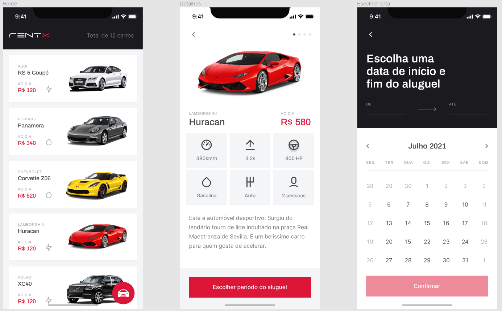
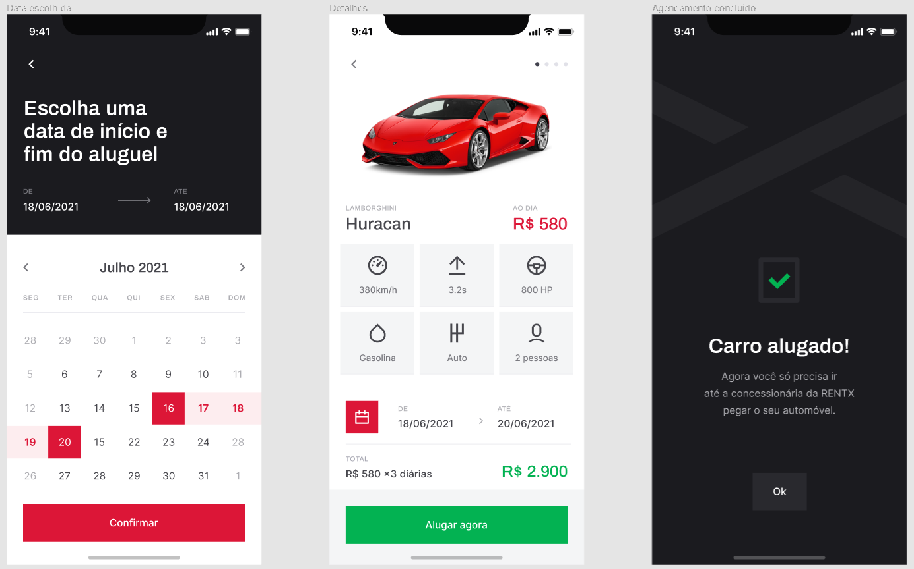
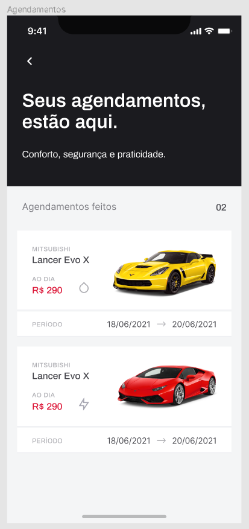

# rentx

> O aplicativo rentx traz uma interface amigável e moderna para aluguéis de automóveis, sendo possível ver detalhes de cada um dos carros disponíveis e agendar as datas de início e fim do aluguel com preços que cabem no seu bolso!

<h4 align="center"> 
	🚧  RentX 🚀 Em construção...  🚧
</h4>

### Features

 -  [ x ] Criação das Interfaces
 -  [ x ] Criação da Navegação
 -  [ x ] Consumo de API
 -  [   ] Criação das Animações

### 🛠 Tecnologias

As seguintes ferramentas foram usadas na construção do projeto:

- [Expo](https://expo.io/)
- [Node.js](https://nodejs.org/en/)
- [React](https://pt-br.reactjs.org/)
- [React Native](https://reactnative.dev/)
- [TypeScript](https://www.typescriptlang.org/)

### Feito com ❤️ por Adauto Moisés 👋🏽 Entre em contato! 

 
