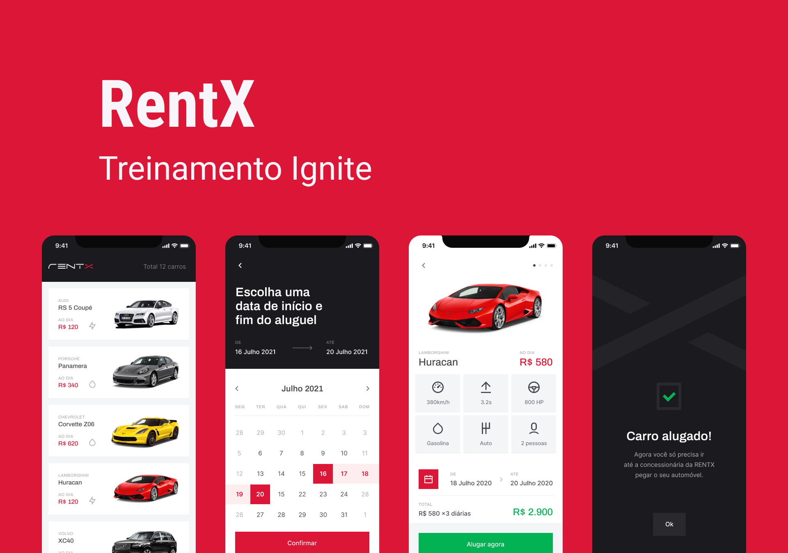

# rentx

<br />
  <div align="center">
    </img>
  </div>
<br />
  <div align="center">
    Fonte: <a href="https://www.figma.com/file/AomhtJeVKDKr6B26Jd8VfI/RentX-Ignite---Offline-First-(Copy)?node-id=14%3A861">Design RentX Figma</a>
  </div> 
<br />

> O aplicativo rentx traz uma interface amigável e moderna para aluguéis de automóveis, sendo possível ver detalhes de cada um dos carros disponíveis e agendar as datas de início e fim do aluguel com preços que cabem no seu bolso!

### 🛠 Tecnologias

As seguintes ferramentas foram usadas na construção do projeto:

- [Expo](https://expo.io/)
- [Node.js](https://nodejs.org/en/)
- [React](https://pt-br.reactjs.org/)
- [React Native](https://reactnative.dev/)
- [TypeScript](https://www.typescriptlang.org/)


### Pré-requisitos

Antes de começar, você vai precisar ter instalado em sua máquina as seguintes ferramentas:
[Git](https://git-scm.com), [Node.js](https://nodejs.org/en/), [Expo](https://docs.expo.dev/get-started/installation/). 
Além disto é bom ter um editor para trabalhar com o código como [VSCode](https://code.visualstudio.com/).

É possível executar um emulador do [Android Studio](https://developer.android.com/studio) ou utilizar o aplicativo Expo Go no Smartphone.

Para inicializar o servidor da aplicação será necessário clonar o repositório [RentX API](https://github.com/adautomoises/rentx-api.git) e executar os comandos a seguir
```
npm install && npm start
```

## 🚀 Instalando RentX

Para instalar o RentX siga estas etapas:

Clone o repositório na sua pasta de preferência.
```
git clone https://github.com/adautomoises/rentx.git
```
Navegue até sua pasta e abra com o VSCode.
Dentro da pasta utilize o comando abaixo e espere instalar as dependências.
```
npm install
```
Após instalação das dependências, pode usar o comando abaixo para executar a aplicação no Emulador ou no seu Smartphone.
```
npx react-native start
```
Abra outro terminal e build o APP em seu Emulador e/ou Startphone utilizando do comando. <br />
OBS: Faz-se necessário o servidor ([RentX API](https://github.com/adautomoises/rentx-api.git)) estar rodando.
```
npx react-native run-android
```

## 📝 Licença

Esse projeto está sob licença. Veja o arquivo [LICENÇA](LICENSE.md) para mais detalhes.
 
 
### Desenvolvido por Adauto Moisés ❤️ Entre em contato comigo em meu <a href="https://www.linkedin.com/posts/adautomoises_opa-eu-estou-de-volta-com-mais-um-projeto-activity-6984350479040299008-mh49?utm_source=share&utm_medium=member_desktop" alt="linkedin" target="_blank"></a>! 
 

 
